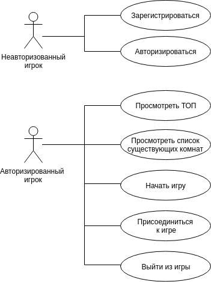
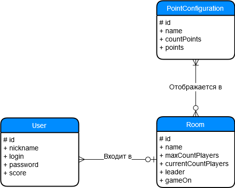
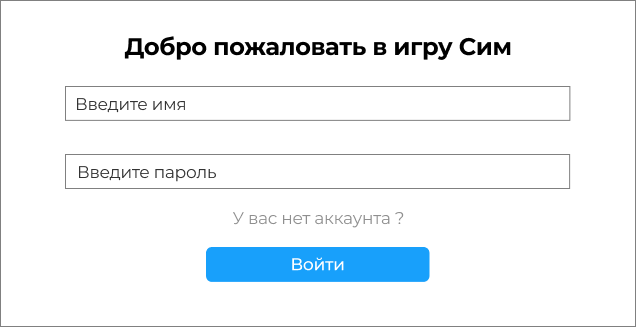
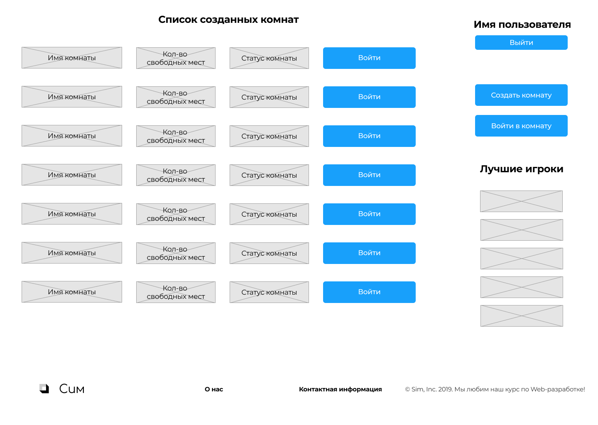
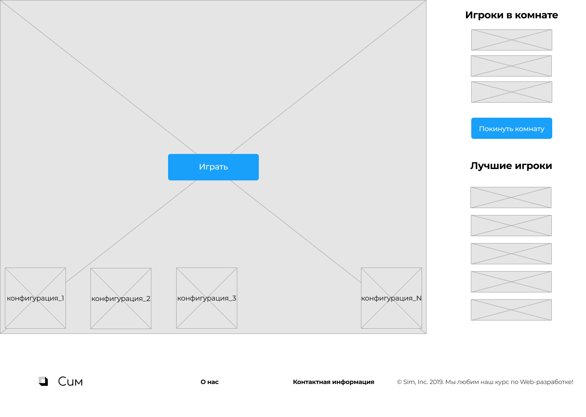
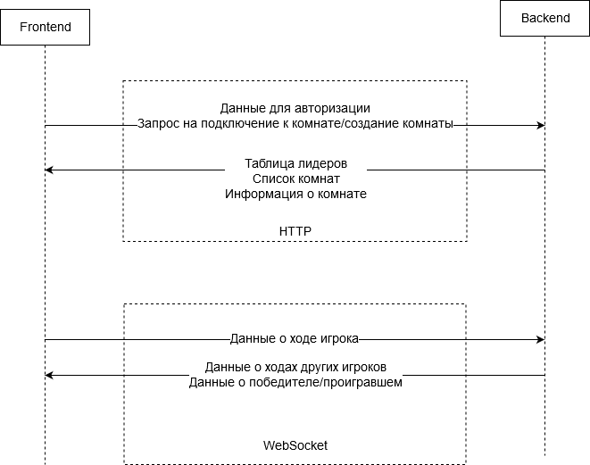
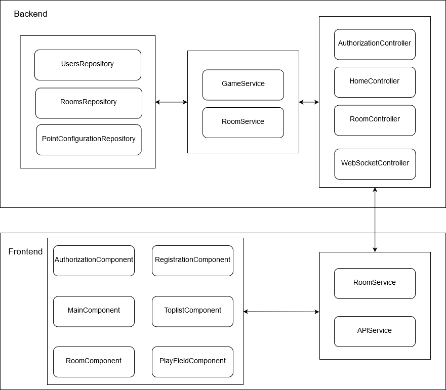

## Игра Сим
Логические игры — это отличный способ провести свой досуг не только интересно и весело, но и с пользой. Игры с логическим уклоном помогают нам развить наши интеллектуальные навыки и при этом сделать это легко и непринуждённо. Именно такой игрой является Сим. Она не отнимает много времени, но в то же время развивает логику и внимательность.

### Описание игры

Игра Сим проходит на поле, на котором отмечены точки согласно некоторой конфигурации. Игроки поочередно соединяют точки отрезками. Каждый игрок для этого использует свой цвет. Проигрывает тот игрок, после хода которого образуется на вершинах треугольник его цвета. Запрещается соединять две вершины прямым отрезком дважды.  

### Описание ролей пользователя

  

### Сущности предметной области

  

### Прототип интерфейса  

Экран входа:  
  

Главный экран:  
  

Экран комнаты:  
  

На главной странице приложения можно создать новую комнату для игры или присоединиться к уже созданной комнате. При создании комнаты есть возможность выбрать название комнаты и максимальное число игроков. Когда в комнате оказывается достаточное количество игроков, лидер комнаты может начать игру. Игрок может выйти из игры или комнаты в любой момент (при выходе непосредственно из игры засчитывается поражение).

### Архитектура приложения

Поскольку в игре происходит достаточно большое количество различных взаимодействий в реальном времени, то в качестве архитектуры приложения была выбрана SPA архитектура.  

Ниже представлена диаграмма взаимодействия Backend-Frontend. Непосредственно игровое взаимодействие будет осуществляться по протоколу WebSocket, обмен остальными данными - по протоколу HTTP.

  

[Описание API](https://app.swaggerhub.com/apis-docs/Wooda/Sim/1.0.0)

Структура классов для Backend/Frontend:  

   

### Технические детали реализации

Backend стек: ASP.NET Core, PostgreSQL  
Frontend стек: Angular, HTML, CSS  
